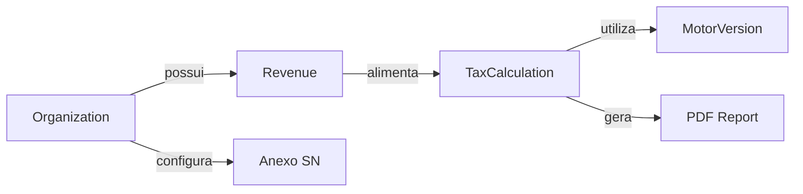
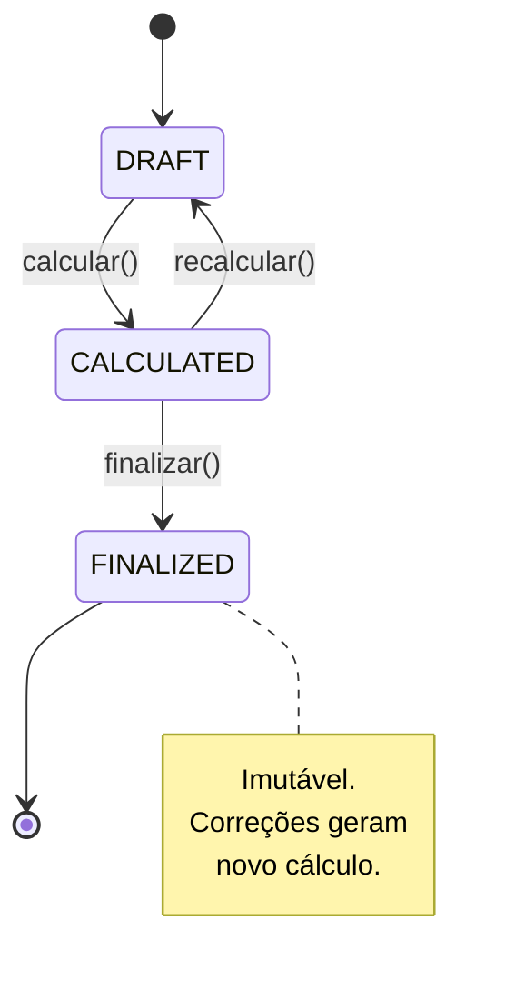
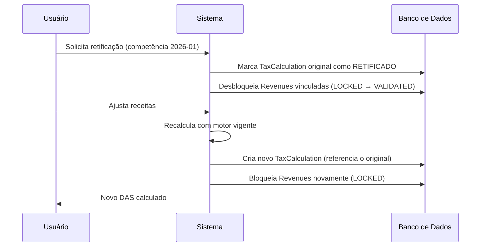

# ContaFacilit — Modelagem de Domínio

> **Versão:** 1.0  
> **Data:** 2026-02-16  
> **Autor:** Arquitetura de Software  
> **Status:** Draft  
> **Referência:** [Foundation Document](./foundation.md)

---

## 1. Visão Geral do Domínio

O domínio central do ContaFacilit é a **apuração tributária do Simples Nacional**. O sistema recebe receitas brutas de profissionais do marketing digital, calcula a alíquota efetiva com base nas regras da Lei Complementar 123/2006 e gera o valor do DAS (Documento de Arrecadação do Simples Nacional) devido.



---

## 2. Entidades de Domínio

### 2.1 Organization

Representa a empresa (CNPJ) cadastrada na plataforma. É a raiz de agregação para isolamento multi-tenant.

```typescript
interface Organization {
  // Identificação
  id: UUID;                          // PK, gerado pelo sistema
  organization_id: UUID;             // Tenant ID (= id para a própria org)
  
  // Dados cadastrais
  cnpj: string;                      // 14 dígitos, único, validado
  razao_social: string;
  nome_fantasia?: string;
  
  // Configuração fiscal
  regime_tributario: 'SIMPLES_NACIONAL';
  anexo_simples: AnexoSimplesNacional; // I | II | III | IV | V
  data_abertura: Date;                // Necessária para cálculo proporcional
  fator_r_aplicavel: boolean;         // true se Anexo V pode migrar para III
  
  // Controle
  status: 'ACTIVE' | 'SUSPENDED' | 'CANCELLED';
  created_at: DateTime;
  updated_at: DateTime;
}
```

**Invariantes:**
- `cnpj` deve ser válido (dígitos verificadores corretos) e único no sistema.
- `anexo_simples` deve ser um dos anexos válidos (I a V).
- `data_abertura` não pode ser futura.
- Uma `Organization` com `status !== 'ACTIVE'` não pode gerar novos `TaxCalculation`.

---

### 2.2 Revenue

Representa uma receita bruta registrada. Entidade criada via upload de CSV ou inserção manual. É **imutável após vinculação a um `TaxCalculation` fechado**.

```typescript
interface Revenue {
  // Identificação
  id: UUID;
  organization_id: UUID;             // FK → Organization (tenant isolation)
  
  // Dados da receita
  competencia: YearMonth;            // Ex: "2026-01" (mês/ano de competência)
  data_recebimento: Date;            // Data efetiva do crédito
  descricao: string;
  valor_bruto: Decimal;              // Precisão: 2 casas decimais, > 0
  origem: string;                    // Ex: "Hotmart", "Kiwify", "Manual"
  
  // Rastreabilidade do upload
  upload_batch_id?: UUID;            // Referência ao lote de importação CSV
  linha_csv?: number;                // Linha original no arquivo CSV
  
  // Controle
  status: 'PENDING' | 'VALIDATED' | 'LOCKED';
  created_at: DateTime;
}
```

**Invariantes:**
- `valor_bruto` deve ser > 0 e ter no máximo 2 casas decimais.
- `competencia` deve estar no formato `YYYY-MM`.
- `data_recebimento` não pode ser futura (tolerância: D+1 por fuso horário).
- Receitas com `status = 'LOCKED'` são **imutáveis** — não podem ser editadas ou excluídas.
- `organization_id` deve referenciar uma `Organization` existente e ativa.

---

### 2.3 TaxCalculation

Representa o resultado de uma apuração tributária para um mês de competência. É o **agregado principal** do domínio. Uma vez finalizado, torna-se **imutável**.

```typescript
interface TaxCalculation {
  // Identificação
  id: UUID;
  organization_id: UUID;             // FK → Organization
  
  // Período
  competencia: YearMonth;            // Mês de apuração
  
  // Inputs do cálculo (snapshot)
  receita_bruta_mes: Decimal;        // Soma das receitas do mês
  rbt12: Decimal;                    // Receita Bruta Total dos últimos 12 meses
  meses_atividade: number;           // Meses desde data_abertura (1-12)
  anexo_aplicado: AnexoSimplesNacional;
  fator_r?: Decimal;                 // Folha 12m / RBT12 (se aplicável)
  
  // Outputs do cálculo
  faixa: number;                     // Faixa do Simples (1 a 6)
  aliquota_nominal: Decimal;         // Alíquota da tabela (%)
  parcela_deduzir: Decimal;          // Valor a deduzir (R$)
  aliquota_efetiva: Decimal;         // Alíquota efetiva calculada (%)
  valor_das: Decimal;                // Valor final do DAS (R$)
  
  // Rastreabilidade
  motor_version_id: UUID;            // FK → MotorVersion utilizada no cálculo
  revenue_ids: UUID[];               // Receitas incluídas neste cálculo
  
  // Controle  
  status: 'DRAFT' | 'CALCULATED' | 'FINALIZED';
  calculated_at?: DateTime;
  finalized_at?: DateTime;
  created_at: DateTime;
}
```

**Invariantes:**
- Só pode existir **um** `TaxCalculation` por `organization_id` + `competencia` (unicidade composta).
- `status` segue a máquina de estados: `DRAFT → CALCULATED → FINALIZED` (sem retrocesso).
- Uma vez `FINALIZED`, o registro é **100% imutável** — qualquer correção gera um **novo** cálculo de retificação.
- `aliquota_efetiva` deve ser ≥ 0 e ≤ alíquota nominal.
- `valor_das` = `receita_bruta_mes × aliquota_efetiva`.
- Todos os campos decimais utilizam precisão de 2 casas (valores) ou 4 casas (alíquotas).

**Máquina de estados:**



---

### 2.4 MotorVersion

Representa uma versão das tabelas de alíquotas do Simples Nacional. Permite rastreabilidade temporal e auditoria de cálculos históricos.

```typescript
interface MotorVersion {
  // Identificação
  id: UUID;
  version: string;                   // Semver: "2026.1.0"
  
  // Vigência
  vigencia_inicio: Date;             // Data de início da vigência
  vigencia_fim?: Date;               // null = versão vigente
  
  // Tabelas
  tabelas: TabelaSimplesNacional[];  // Tabelas por anexo
  
  // Controle
  publicada: boolean;                // Só versões publicadas são usadas
  created_at: DateTime;
  changelog: string;                 // Descrição da alteração
}

interface TabelaSimplesNacional {
  anexo: AnexoSimplesNacional;
  faixas: FaixaSimplesNacional[];
}

interface FaixaSimplesNacional {
  faixa: number;                     // 1 a 6
  rbt12_de: Decimal;                 // Limite inferior (inclusive)
  rbt12_ate: Decimal;                // Limite superior (inclusive)
  aliquota_nominal: Decimal;         // Em percentual (ex: 6.00)
  parcela_deduzir: Decimal;          // Em reais (ex: 0.00)
}

type AnexoSimplesNacional = 'I' | 'II' | 'III' | 'IV' | 'V';
```

**Invariantes:**
- Apenas **uma** `MotorVersion` pode ter `vigencia_fim = null` por vez (versão corrente).
- Uma `MotorVersion` publicada é **imutável**. Alterações exigem nova versão.
- As faixas de cada anexo devem cobrir **todo** o intervalo de R$ 0,01 a R$ 4.800.000,00 sem sobreposição e sem lacunas.
- `aliquota_nominal` e `parcela_deduzir` devem ser ≥ 0.

---

## 3. Formalização do Cálculo do Simples Nacional

### 3.1 Fórmula da Alíquota Efetiva

A alíquota efetiva do Simples Nacional é definida pela LC 123/2006, Art. 18:

```
                (RBT12 × Aliq_nom) − PD
Aliq_efetiva = ─────────────────────────
                        RBT12
```

Onde:
- **RBT12** = Receita Bruta Total acumulada nos 12 meses anteriores ao período de apuração
- **Aliq_nom** = Alíquota nominal da faixa correspondente ao RBT12
- **PD** = Parcela a deduzir da faixa

### 3.2 Valor do DAS

```
DAS = Receita_bruta_mês × Aliq_efetiva
```

### 3.3 Cálculo do RBT12

O RBT12 é a soma das receitas brutas dos **12 meses anteriores** ao mês de apuração (não inclui o mês atual).

```
RBT12(competência M) = Σ Receita_bruta(M-12 .. M-1)
```

**Regras especiais:**

| Cenário | Regra |
|---|---|
| Empresa com < 12 meses de atividade | RBT12 = (receita acumulada ÷ meses de atividade) × 12 **(RBT12 proporcionalizada)** |
| Empresa no 1º mês | RBT12 = receita do mês × 12 (projeção) |
| Mês sem receita | Considerar R$ 0,00 para aquele mês no somatório |

**Pseudocódigo:**

```python
def calcular_rbt12(org: Organization, competencia: YearMonth) -> Decimal:
    meses_atividade = calcular_meses_atividade(org.data_abertura, competencia)
    
    if meses_atividade >= 13:
        # Empresa com mais de 12 meses — somatório normal
        receitas = buscar_receitas(org.id, competencia - 12, competencia - 1)
        return sum(r.valor_bruto for r in receitas)
    else:
        # Empresa com menos de 13 meses — proporcionalização
        meses_efetivos = min(meses_atividade - 1, 12)  # exclui mês corrente
        if meses_efetivos <= 0:
            # Primeiro mês de atividade
            receita_mes = buscar_receita_mes(org.id, competencia)
            return receita_mes * 12
        
        receitas = buscar_receitas(org.id, org.data_abertura, competencia - 1)
        receita_acumulada = sum(r.valor_bruto for r in receitas)
        media_mensal = receita_acumulada / meses_efetivos
        return media_mensal * 12
```

---

### 3.4 Tabelas do Simples Nacional — Anexo III (Serviços)

Aplicável a: receitas de prestação de serviços (consultoria de tráfego, agências, etc.)

| Faixa | RBT12 (R$) | Alíquota Nominal | Parcela a Deduzir (R$) |
|---|---|---|---|
| 1ª | Até 180.000,00 | 6,00% | 0,00 |
| 2ª | De 180.000,01 a 360.000,00 | 11,20% | 9.360,00 |
| 3ª | De 360.000,01 a 720.000,00 | 13,50% | 17.640,00 |
| 4ª | De 720.000,01 a 1.800.000,00 | 16,00% | 35.640,00 |
| 5ª | De 1.800.000,01 a 3.600.000,00 | 21,00% | 125.640,00 |
| 6ª | De 3.600.000,01 a 4.800.000,00 | 33,00% | 648.000,00 |

### 3.5 Tabelas do Simples Nacional — Anexo V (Serviços Intelectuais)

Aplicável a: atividades intelectuais, tecnologia, quando Fator R < 28%.

| Faixa | RBT12 (R$) | Alíquota Nominal | Parcela a Deduzir (R$) |
|---|---|---|---|
| 1ª | Até 180.000,00 | 15,50% | 0,00 |
| 2ª | De 180.000,01 a 360.000,00 | 18,00% | 4.500,00 |
| 3ª | De 360.000,01 a 720.000,00 | 19,50% | 9.900,00 |
| 4ª | De 720.000,01 a 1.800.000,00 | 20,50% | 17.100,00 |
| 5ª | De 1.800.000,01 a 3.600.000,00 | 23,00% | 62.100,00 |
| 6ª | De 3.600.000,01 a 4.800.000,00 | 30,50% | 540.000,00 |

### 3.6 Fator R — Migração entre Anexo V e Anexo III

O **Fator R** determina se uma empresa enquadrada no Anexo V pode ser tributada pelo Anexo III (alíquotas menores).

```
              Folha de Salários (12 meses)
Fator R = ──────────────────────────────────
                      RBT12
```

| Fator R | Anexo Aplicado |
|---|---|
| ≥ 28% | Anexo III |
| < 28% | Anexo V |

> [!IMPORTANT]
> Na V1, o Fator R será informado **manualmente** pelo usuário (campo numérico). A integração com folha de pagamento está fora do escopo.

---

## 4. Edge Cases Fiscais

### 4.1 Empresa no Primeiro Mês de Atividade

- **Problema:** Não há receita histórica para calcular o RBT12.
- **Regra:** Projetar a receita do mês corrente × 12.
- **Risco:** Pode enquadrar em faixa incorreta se o mês for atípico.
- **Tratamento:** Exibir alerta ao usuário informando que o cálculo é projetado.

### 4.2 Empresa com 2 a 12 Meses de Atividade

- **Problema:** RBT12 deve ser proporcionalizado.
- **Regra:** `RBT12 = (receita acumulada ÷ meses efetivos) × 12`.
- **Tratamento:** Armazenar `meses_atividade` no `TaxCalculation` para auditoria.

### 4.3 RBT12 Exatamente no Limite de Faixa

- **Problema:** Um RBT12 de exatamente R$ 180.000,00 pode gerar ambiguidade.
- **Regra:** O limite superior de cada faixa é **inclusivo**. R$ 180.000,00 pertence à 1ª faixa.
- **Tratamento:** Usar comparação `<=` para limite superior.

### 4.4 Sublimite Estadual e ISS

- **Problema:** Estados podem ter sublimites para ICMS e ISS (ex: R$ 3.600.000,00).
- **Regra V1:** Não implementar separação de tributos por estado. Calcular apenas DAS total.
- **Tratamento:** Documentar como limitação conhecida. Exibir nota de rodapé nos relatórios.

### 4.5 Ultrapassagem do Teto de R$ 4.800.000,00

- **Problema:** Empresa que ultrapassa RBT12 de R$ 4.800.000,00 é excluída do Simples.
- **Regra:** O sistema **não deve** gerar cálculo. Deve exibir alerta de exclusão obrigatória.
- **Tratamento:** Bloquear cálculo e orientar o usuário a procurar um contador.

### 4.6 Receitas em Meses sem Movimento

- **Problema:** Meses com R$ 0,00 de receita não geram DAS, mas impactam o RBT12.
- **Regra:** Registrar R$ 0,00 no mês e manter o cálculo do RBT12 correto.
- **Tratamento:** Permitir "fechar mês sem movimento" e gerar relatório zerado.

### 4.7 Mudança de Anexo no Meio do Ano

- **Problema:** Se atividade principal da empresa mudar, o anexo pode ser alterado.
- **Regra V1:** A mudança de anexo reflete a partir do mês seguinte à alteração no cadastro.
- **Tratamento:** Os cálculos anteriores (FINALIZED) permanecem com o anexo utilizado à época.

### 4.8 Arredondamento

- **Problema:** Diferentes formas de arredondamento geram divergências em centavos.
- **Regra:** Utilizar **arredondamento HALF_UP** (regra bancária) com 2 casas decimais para valores e 4 casas para alíquotas.
- **Tratamento:** Implementar tipo `Decimal` dedicado, nunca `float`/`double`.

### 4.9 Fator R Flutuante entre Meses

- **Problema:** O Fator R pode oscilar acima/abaixo de 28% entre competências.
- **Regra:** O Fator R é calculado **mês a mês**. Pode alternar entre Anexo III e V.
- **Tratamento:** Armazenar `fator_r` e `anexo_aplicado` em cada `TaxCalculation`.

---

## 5. Contrato Técnico do Motor Tributário

### 5.1 Interface do Motor

```typescript
interface TaxEngineContract {
  /**
   * Calcula o Simples Nacional para uma competência.
   * 
   * @throws InvalidRBT12Error - Se RBT12 > 4.800.000,00
   * @throws NoRevenueDataError - Se não há receitas para calcular
   * @throws InvalidMotorVersionError - Se não há MotorVersion vigente
   */
  calculate(input: TaxEngineInput): TaxEngineOutput;
}

interface TaxEngineInput {
  organization_id: UUID;
  competencia: YearMonth;
  receita_bruta_mes: Decimal;        // Soma das receitas do mês
  rbt12: Decimal;                    // Calculado externamente
  anexo: AnexoSimplesNacional;       // Determinado pela org ou Fator R
  fator_r?: Decimal;                 // Obrigatório se anexo = V e fator_r_aplicavel
  motor_version_id: UUID;            // Versão da tabela a utilizar
}

interface TaxEngineOutput {
  faixa: number;
  aliquota_nominal: Decimal;
  parcela_deduzir: Decimal;
  aliquota_efetiva: Decimal;         // 4 casas decimais
  valor_das: Decimal;                // 2 casas decimais
  anexo_aplicado: AnexoSimplesNacional;
  motor_version_id: UUID;
  calculated_at: DateTime;
  warnings: TaxWarning[];            // Alertas não bloqueantes
}

interface TaxWarning {
  code: string;                      // Ex: "PROJECAO_RBT12", "PROXIMO_TETO"
  message: string;
  severity: 'INFO' | 'WARNING';
}
```

### 5.2 Erros Tipados

| Código | Classe | Descrição |
|---|---|---|
| `EXCEEDED_LIMIT` | `InvalidRBT12Error` | RBT12 > R$ 4.800.000,00 — empresa excluída do Simples |
| `NO_REVENUE` | `NoRevenueDataError` | Não há receitas registradas para a competência |
| `NO_MOTOR` | `InvalidMotorVersionError` | Nenhuma MotorVersion publicada e vigente |
| `INVALID_FATOR_R` | `InvalidFatorRError` | Fator R obrigatório mas não informado |
| `INVALID_ANEXO` | `InvalidAnexoError` | Anexo informado não reconhecido |

### 5.3 Regras de Execução

1. O motor é uma **função pura**: dado o mesmo input, sempre produz o mesmo output.
2. O motor **não** acessa banco de dados diretamente. Recebe dados já resolvidos.
3. O motor **não** gerencia estado. O chamador é responsável por persistir o resultado.
4. Todo cálculo é rastreável via `motor_version_id`.
5. O motor emite `warnings` para situações não-bloqueantes (ex: RBT12 projetado, proximidade do teto).

---

## 6. Regras de Imutabilidade

A imutabilidade é essencial para auditoria fiscal e conformidade legal. O sistema adota as seguintes regras:

### 6.1 Matriz de Imutabilidade

| Entidade | Condição de Imutabilidade | Campos Imutáveis | Correção Permitida |
|---|---|---|---|
| **Organization** | Nunca totalmente imutável | `id`, `cnpj`, `created_at` | Editar dados cadastrais a qualquer momento |
| **Revenue** | `status = 'LOCKED'` | Todos os campos | Criar nova receita de estorno/ajuste |
| **TaxCalculation** | `status = 'FINALIZED'` | Todos os campos | Criar novo cálculo de retificação |
| **MotorVersion** | `publicada = true` | Todos os campos | Criar nova versão |

### 6.2 Fluxo de Correção

Quando um cálculo finalizado precisa ser corrigido (erro de input, receita esquecida, etc.):



### 6.3 Auditoria

Todos os registros possuem:
- `created_at`: timestamp de criação (imutável)
- `updated_at`: timestamp da última alteração (quando aplicável)
- Registros imutáveis **não possuem** `updated_at` — qualquer alteração é proibida em nível de aplicação e banco de dados (trigger de proteção)

---

## 7. Exemplo de Cálculo Completo

### Cenário: Agência Digital — Anexo III — Competência Janeiro/2026

**Dados:**
- Receita bruta jan/2026: R$ 45.000,00
- RBT12 (fev/2025 a jan/2026... considerando meses anteriores): R$ 420.000,00
- Anexo: III
- Fator R: Não aplicável (já no Anexo III)

**Passo 1 — Identificar faixa:**
- RBT12 = R$ 420.000,00 → **3ª faixa** (R$ 360.000,01 a R$ 720.000,00)
- Alíquota nominal = 13,50%
- Parcela a deduzir = R$ 17.640,00

**Passo 2 — Calcular alíquota efetiva:**
```
Aliq_efetiva = (420.000,00 × 0,1350 − 17.640,00) ÷ 420.000,00
Aliq_efetiva = (56.700,00 − 17.640,00) ÷ 420.000,00
Aliq_efetiva = 39.060,00 ÷ 420.000,00
Aliq_efetiva = 0,0930 = 9,30%
```

**Passo 3 — Calcular DAS:**
```
DAS = 45.000,00 × 0,0930 = R$ 4.185,00
```

**Resultado:**
| Campo | Valor |
|---|---|
| Faixa | 3ª |
| Alíquota nominal | 13,50% |
| Parcela a deduzir | R$ 17.640,00 |
| Alíquota efetiva | 9,30% |
| **Valor do DAS** | **R$ 4.185,00** |

---

### Cenário: Gestor de Tráfego — Anexo V com Fator R — Competência Março/2026

**Dados:**
- Receita bruta mar/2026: R$ 25.000,00
- RBT12: R$ 250.000,00
- Folha de salários 12 meses: R$ 80.000,00
- Anexo configurado: V
- Fator R aplicável: sim

**Passo 1 — Calcular Fator R:**
```
Fator R = 80.000,00 ÷ 250.000,00 = 0,32 = 32%
```
Fator R ≥ 28% → **Migra para Anexo III**

**Passo 2 — Identificar faixa (Anexo III):**
- RBT12 = R$ 250.000,00 → **2ª faixa** (R$ 180.000,01 a R$ 360.000,00)
- Alíquota nominal = 11,20%
- Parcela a deduzir = R$ 9.360,00

**Passo 3 — Calcular alíquota efetiva:**
```
Aliq_efetiva = (250.000,00 × 0,1120 − 9.360,00) ÷ 250.000,00
Aliq_efetiva = (28.000,00 − 9.360,00) ÷ 250.000,00
Aliq_efetiva = 18.640,00 ÷ 250.000,00
Aliq_efetiva = 0,07456 = 7,4560%
```

**Passo 4 — Calcular DAS:**
```
DAS = 25.000,00 × 0,074560 = R$ 1.864,00
```

**Resultado:**
| Campo | Valor |
|---|---|
| Fator R | 32% |
| Anexo aplicado | III (migrado do V) |
| Faixa | 2ª |
| Alíquota efetiva | 7,4560% |
| **Valor do DAS** | **R$ 1.864,00** |

---

## 8. Glossário

| Termo | Definição |
|---|---|
| **DAS** | Documento de Arrecadação do Simples Nacional — guia de pagamento unificada |
| **RBT12** | Receita Bruta Total dos últimos 12 meses anteriores ao período de apuração |
| **Fator R** | Razão entre folha de salários (12 meses) e RBT12, utilizado para determinar o anexo aplicável |
| **Anexo** | Tabela de alíquotas do Simples Nacional, organizada por tipo de atividade (I a V) |
| **Competência** | Mês/ano a que se refere a apuração tributária |
| **Alíquota Efetiva** | Percentual real de imposto aplicado após ajuste pela parcela a deduzir |
| **LC 123/2006** | Lei Complementar que institui o Simples Nacional |

---

## Histórico de Versões

| Versão | Data | Autor | Descrição |
|---|---|---|---|
| 1.0 | 2026-02-16 | Arquitetura de Software | Versão inicial — entidades, cálculo, edge cases e contrato do motor |

---

> **Próximos passos:** Implementar o motor tributário como módulo isolado com testes unitários cobrindo todos os edge cases documentados. Definir schema SQL baseado nesta modelagem.
