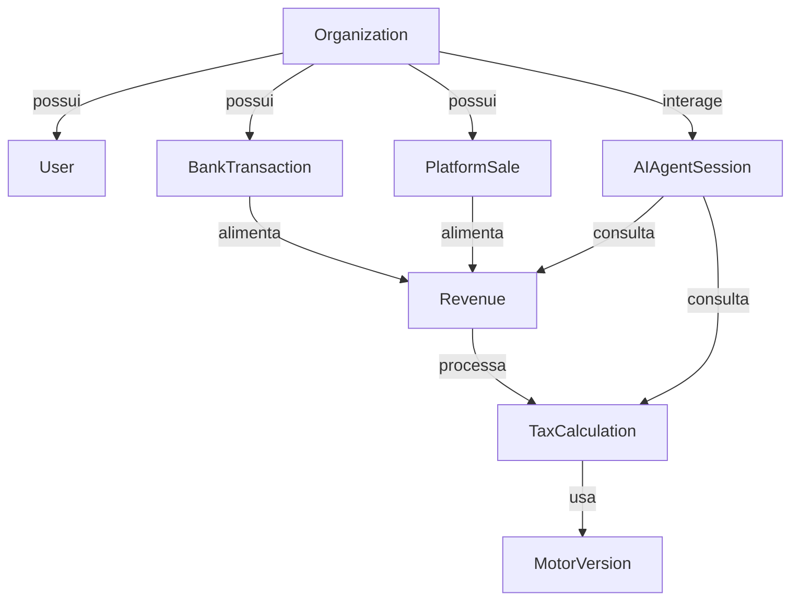

# ContaFacilit — Modelagem de Domínio (Atualizado)

> **Versão:** 2.0  
> **Data:** 2026-02-16  
> **Status:** Finalizado (Pronto para Versionamento)  
> **Especialidade:** Contabilidade Digital Automatizada

---

## 1. Visão Geral do Domínio

O domínio do ContaFacilit expandiu de um motor tributário para um ecossistema de contabilidade digital. O sistema agora integra dados bancários e de plataformas de vendas para automatizar o cumprimento fiscal e oferecer inteligência via IA.



---

## 2. Novas Entidades de Integração

### 2.1 BankTransaction (Open Finance)
Representa uma entrada ou saída capturada via API bancária.

```typescript
interface BankTransaction {
  id: UUID;
  organization_id: UUID;
  external_id: string;          // ID original no banco
  amount: Decimal;
  description: string;
  category: string;             // Ex: "Venda", "Tarifa", "Transferência"
  date: Date;
  status: 'PENDING' | 'RECONCILED' | 'IGNORED';
  provider: 'PLUGGY' | 'BELVO';
}
```

### 2.2 PlatformSale (Marketing Digital)
Representa uma venda capturada via Webhook (Hotmart, Kiwify, etc).

```typescript
interface PlatformSale {
  id: UUID;
  organization_id: UUID;
  platform: string;             // "HOTMART" | "KIWIFY" | "EDUZZ"
  external_sale_id: string;
  gross_amount: Decimal;
  net_amount: Decimal;
  fee_amount: Decimal;
  status: 'PAID' | 'REFUNDED' | 'CHARGEBACK';
  customer_email: string;
  occurred_at: DateTime;
}
```

### 2.3 AIAgentSession
Logs de interação entre o usuário e o Agente IA.

```typescript
interface AIAgentSession {
  id: UUID;
  organization_id: UUID;
  user_id: UUID;
  messages: Array<{
    role: 'USER' | 'ASSISTANT';
    content: string;
    timestamp: DateTime;
  }>;
  context_references: {
    tax_calculations?: UUID[];
    revenues?: UUID[];
  };
}
```

---

## 3. Entidades Core (Refinadas)

As entidades de **Revenue** e **TaxCalculation** permanecem como o coração do sistema, mas agora recebem dados automaticamente das entidades de integração.

### 3.1 Revenue (Receita Consolidada)
- **Origem:** Agora pode ser `MANUAL`, `BANK_SYNC` ou `PLATFORM_SYNC`.
- **Vínculo:** Pode referenciar o `PlatformSale.id` original para auditoria.

### 3.2 TaxCalculation (Apuração)
- Mantém a lógica de RBT12 e Fator R.
- **Histórico:** Registra a `AIAgentSession.id` se o cálculo foi solicitado via chat.

---

## 4. Invariantes de Segurança & LGPD

- **Data Isolation:** O `organization_id` é o discriminador obrigatório em todas as queries.
- **Anonymization:** O Agente IA deve ocultar dados sensíveis de clientes finais (CPFs/E-mails em `PlatformSale`) ao gerar respostas, a menos que explicitamente necessário.
- **Auditoria:** Toda alteração em `BankTransaction` ou `Revenue` gera um rastro na tabela `audit_logs`.

---

## 5. Histórico de Versões

| Versão | Data | Descrição |
|---|---|---|
| 1.0 | 2026-02-16 | Versão inicial focada no motor tributário. |
| 2.0 | 2026-02-16 | Inclusão de integrações bancárias, plataformas e Agente IA. |

---
