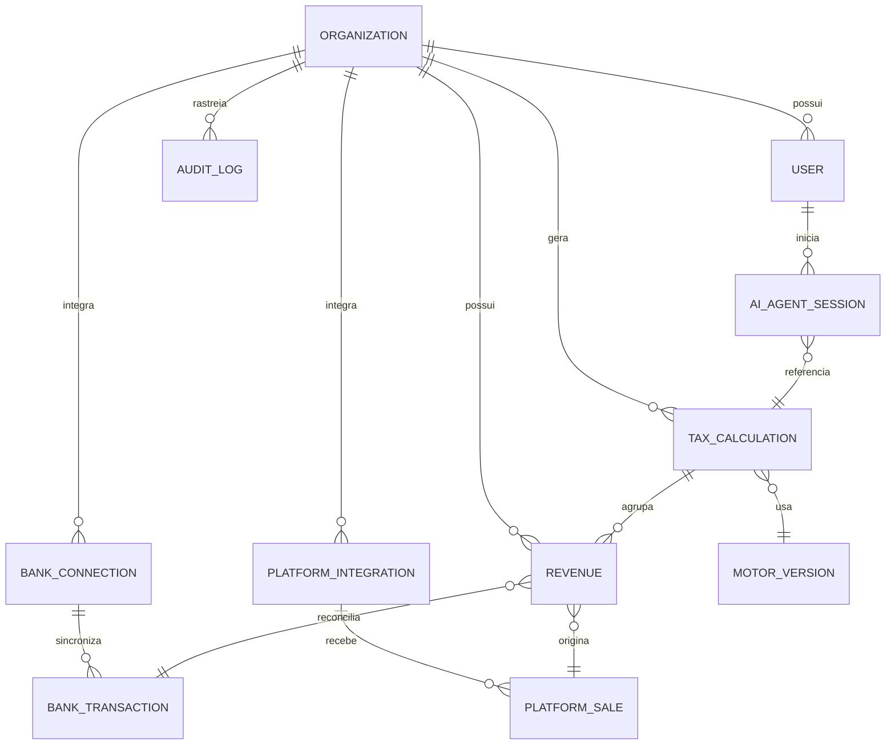

# ContaFacilit — Modelagem de Domínio (Fase 1 - Atualizado)

> **Versão:** 3.0  
> **Data:** 2026-02-16  
> **Especialidade:** Arquitetura de Domínio Fiscal e Financeiro SaaS  
> **Referência:** [Foundation Document](./foundation.md)

---

## 1. Contexto Multi-tenant (`organization_id`)

O sistema adota o modelo de **Shared Database com Isolamento Lógico**. 

- **Invariante Global:** Toda e qualquer entidade de negócio (exceto metadados globais como `MotorVersion`) **DEVE** possuir um `organization_id`.
- **Enforcement:** O isolamento é aplicado em três níveis:
    1. **JWT Payload:** O tenant ID é imutável dentro da sessão.
    2. **Aplicação:** Services e Repositories injetam o tenant ID em todas as cláusulas `WHERE`.
    3. **Banco de Dados (RLS):** Policies de Row-Level Security no PostgreSQL atuam como a última linha de defesa.

---

## 2. Domínios de Integração

### 2.1 Integração Bancária (Finanças)
Responsável por capturar o fluxo de caixa real para conciliação.

**Entidades:**
- **BankConnection:** Armazena tokens (criptografados) e metadados da conexão com o provedor (Pluggy/Belvo).
- **BankTransaction:** Registro atômico de uma movimentação financeira.
- **Reconciliation:** Elo de ligação entre uma `BankTransaction` e uma `Revenue`.

**Invariantes:**
- Uma `BankTransaction` não pode ser reconciliada com valor superior ao seu próprio montante.
- O `status` de uma transação muda para `RECONCILED` apenas quando a soma das `Reconciliation` vinculadas atinge o `amount` total.

---

### 2.2 Integração com Plataformas Digitais
Captura eventos de vendas e estornos em tempo real.

**Entidades:**
- **PlatformIntegration:** Configuração de Webhooks e Chaves de API (Hotmart, Kiwify, Eduzz).
- **PlatformSale:** Snapshopt da venda conforme recebido da origem.
- **WebhookEvent:** Log bruto de todos os payloads recebidos para fins de depuração e re-processamento.

**Casos de Borda:**
- **Retroatividade:** Vendas de meses passados que chegam com atraso.
- **Refund/Chargeback:** Devem gerar automaticamente um registro de "Receita Negativa" ou ajuste no mês de ocorrência, conforme regra da Receita Federal.

---

## 3. Motor Tributário (Simples Nacional)

O coração do sistema, projetado para ser **Auditável** e **Imutável**.

### 3.1 MotorVersion & Regras
- **Versioning:** O motor é versionado (ex: `v2026.02.01`). Cada cálculo armazena o ID da versão utilizada.
- **TaxRule:** Metadados que definem faixas e alíquotas de cada anexo (I a V).

### 3.2 Invariantes do Cálculo (RBT12 & Fator R)
- **RBT12 Proporcional:** Se atividade < 12 meses, aplica-se a fórmula de média aritmética multiplicada por 12.
- **Detecção de Exclusão:** Se RBT12 > 4.8MM, o motor bloqueia o cálculo e dispara alerta de transição para Lucro Presumido.
- **Fator R:** Razão entre folha (12m) e receita (12m). Se ≥ 28%, o motor migra automaticamente o cálculo do Anexo V para o III.

**Regras de Imutabilidade:**
- Após o `TaxCalculation` atingir o status `FINALIZED`, ele e todas as `Revenue` vinculadas tornam-se **ReadOnly**.
- **Retificações:** Não editam o cálculo original; criam um novo registro com `parent_calculation_id` e anulam o anterior.

---

## 4. Agente IA com Contexto Empresarial

O Agente IA não é apenas um chat, mas um orquestrador de contexto.

**Entidades:**
- **AIAgentSession:** Sessão ativa de interação.
- **ContextWindow:** Conjunto de "Fatos de Negócio" (Revenues, TaxCalculations, BankStats) enviados como contexto na janela do modelo (RAG/Prompt Injection).
- **BusinessFact:** Uma abstração que simplifica dados complexos para a IA (ex: "Sua alíquota efetiva subiu 2% este mês devido ao aumento do RBT12").

**Segurança IA:**
- **Tenant Leakage:** A IA nunca tem acesso a fatos de outras `organization_id`.
- **Anonymization:** Dados de terceiros (e-mails de compradores) são mascarados antes de chegarem ao provedor de LLM.

---

## 5. Auditoria & Governança

### 5.1 AuditLog (Trilha de Auditoria)
Todo evento crítico (Login, Alteração de Configuração Fiscal, Finalização de Imposto) deve registrar:
- `actor_id` (User)
- `action` (Create/Update/Delete/Calculate)
- `payload_before` / `payload_after` (JSONB)
- `ip_address` e `user_agent`

### 5.2 Segurança & LGPD
- **Encryption at Rest:** Dados sensíveis de faturamento.
- **Data Retention:** Políticas automáticas para expurgar `WebhookEvent` brutos após 90 dias, mantendo apenas `PlatformSale` processado.

---

## 6. Mapeamento de Relacionamentos (Mermaid)

---

## 7. Edge Cases e Soluções

| Caso de Borda | Solução de Domínio |
| :--- | :--- |
| **Mudança de Anexo** | O sistema trava o histórico e aplica o novo anexo apenas em competências futuras. |
| **Moeda Estrangeira** | Conversão automática via API de cotação na data do `occurred_at` da venda. |
| **Múltiplos Sócios** | O Fator R considera a soma de todos os pró-labores registrados na `Organization`. |
| **Concomitância de Anexos** | Suporte a cálculos híbridos (ex: uma parte da receita no Anexo III e outra no V). |

---
